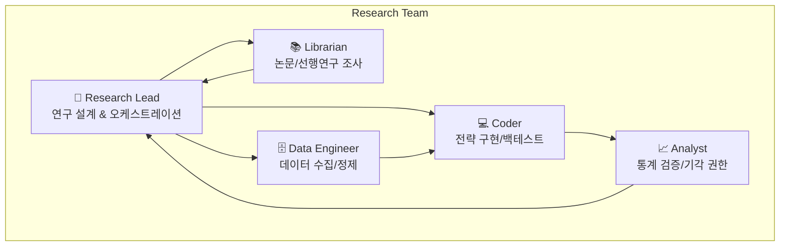
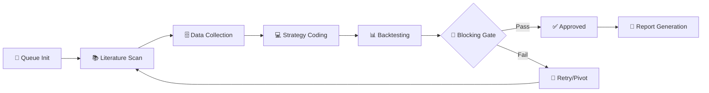

# 🔬 OpenCode Multi-Agent Research Team

> **AI 에이전트 팀 기반의 자율적 퀀트 전략 리서치 프레임워크**

OpenCode의 멀티 에이전트 시스템을 활용하여 구성된 **독립 리서치 팀(Independent Research Team)**입니다. 5인의 전문 AI 에이전트가 협업하여 금융 시장의 알파(Alpha)를 탐색하고, 통계적으로 검증된 트레이딩 전략을 자동으로 발굴합니다.

---

## 📋 목차

- [개요](#-개요)
- [핵심 기능](#-핵심-기능)
- [팀 구성](#-팀-구성)
- [워크플로우](#-워크플로우)
- [설치 및 설정](#-설치-및-설정)
- [사용법](#-사용법)
- [프로젝트 산출물 구조](#-프로젝트-산출물-구조)
- [KPI 및 검증 기준](#-kpi-및-검증-기준)
- [창의적 알파 탐색](#-창의적-알파-탐색)
- [설정 파일](#-설정-파일)
- [라이선스](#-라이선스)

---

## 🎯 개요

이 프로젝트는 **OpenCode** 플랫폼의 멀티 에이전트 기능을 활용하여 구축된 자동화된 퀀트 리서치 시스템입니다.

### 주요 특징

| 특징 | 설명 |
|------|------|
| **완전 자율 연구** | 사용자 개입 없이 가설 수립부터 검증까지 자동 진행 |
| **엄격한 통계 검증** | Monte Carlo, Bootstrap, Walk-Forward 검증 필수 통과 |
| **3대 배제 원칙** | 오버피팅, 데이터 누수, 편향 엄격히 배제 |
| **다중 자산 지원** | Crypto, Nasdaq, FX, Futures 등 전 세계 유동 자산 대상 |
| **양방향 격리** | 리서치 모드와 일반 모드 간 에이전트 완전 격리 |

---

## ✨ 핵심 기능

### 🔄 무한 채굴 모드 (Infinite Mining)
목표한 성공 전략 수를 달성할 때까지 **멈추지 않고** 가설을 생성하고 검증합니다.

```bash
# 예시: 10개의 성공 전략을 찾을 때까지 자동 탐색
/rt mine crypto 10
```

### 🧪 심층 연구 모드 (Deep Research)
특정 가설에 대해 성공할 때까지 집요하게 파고드는 모드입니다.

```bash
# 예시: 특정 전략 가설 심층 연구
/rt BTC 변동성 돌파 전략
```

### 📊 실시간 진행 상황 추적
`research_queue.md` 파일에 실시간으로 진행 상황이 업데이트됩니다:
- 가설별 진행 상태 (⬜ 대기 | 🔄 진행중 | ✅ 완료 | ❌ 기각)
- 체크리스트 기반 검증 단계 추적
- 컨텍스트 사용량 모니터링

---

## 👥 팀 구성

리서치 팀은 5인의 전문 AI 에이전트로 구성됩니다:



### 역할 상세

| 에이전트 | 역할 | 책임 |
|----------|------|------|
| **@research-lead** | Chief Architect | 연구 설계, 가설 수립, 전체 오케스트레이션, 최종 리포트 생성 |
| **@research-librarian** | PhD Specialist | 수학적 증명, 논문 검색(ArXiv, SSRN), 기술적 진실 탐구 |
| **@research-data-engineer** | Lead Data Engineer | 데이터 수집/정제, Point-in-Time 보장, Survivorship Bias 제거 |
| **@research-coder** | Lead Financial Engineer | 백테스팅 엔진 구현, 전략 코드 작성, `.shift(1)` 원칙 준수 |
| **@research-analyst** | Chief Risk Officer | 통계 검증, **[THE FINDING GATE]** - 전략 기각 권한 보유 |

---

## 🔁 워크플로우

### 표준 연구 프로세스



### Blocking Gate (필수 통과 조건)

| 검증 항목 | 기준 | 미통과 시 조치 |
|-----------|------|----------------|
| IS/OOS KPI 비율 | OOS ≥ IS × 70% | 파라미터 축소, 피처 제거 |
| Monte Carlo p-value | < 0.05 (1000회 셔플) | 시그널 로직 단순화 |
| Bootstrap 95% CI | 주요 KPI 하한 > 0 | 샘플 확대, 필터 완화 |
| WFO 일관성 | 3-fold 이상, Embargo 적용 | 과적합 피처 제거 |
| Trade Count | N > 30 | 진입 조건 완화 |

---

## 🚀 설치 및 설정

### 사전 요구사항

- [OpenCode](https://github.com/opencode/opencode) 설치
- Python 3.11+
- 멀티 에이전트 지원 AI 모델 API 키

### 1. 저장소 클론

```bash
git clone https://github.com/your-username/opencode-research-team.git
cd opencode-research-team
```

### 2. 설정 파일 배치

```powershell
# OpenCode 설정 디렉토리에 에이전트 설정 복사
Copy-Item oh-my-opencode.json ~/.config/opencode/

# 글로벌 규칙 및 팀 매뉴얼 배치
Copy-Item AGENTS.md ~/
Copy-Item RESEARCH_TEAM.md ~/
```

### 3. Python 환경 설정 (선택)

```powershell
# 기본 퀀트 환경 생성
python -m venv C:\envs\quant-base
C:\envs\quant-base\Scripts\activate
pip install pandas numpy scipy ta-lib ccxt matplotlib
```

### 환경 구조

| 환경 | 경로 | 용도 |
|------|------|------|
| `quant-base` | `C:\envs\quant-base` | 표준 퀀트 (pandas, numpy, ta-lib, ccxt) |
| `quant-ml` | `C:\envs\quant-ml` | ML 전략 (+ sklearn, xgboost, lightgbm) |
| `quant-dl` | `C:\envs\quant-dl` | 딥러닝 (+ tensorflow, pytorch) |

---

## 📖 사용법

### 리서치 모드 시작

```bash
# OpenCode 실행 후 리서치 모드 활성화
opencode

# 리서치 모드 진입
> /rt [연구 주제 또는 가설]

# 예시들
> /rt BTC 펀딩비 기반 역추세 전략
> /rt mine crypto 5    # 5개 성공 전략 찾을 때까지 채굴
> /rt continue queue   # 중단된 연구 재개
```

### 일반 모드 (Standard Mode)

리서치 모드 외의 모든 작업은 일반 에이전트(@oracle, @coder, @backtester 등)가 담당합니다.

```bash
# 일반 전략 개발
> @coder BTC 모멘텀 전략 구현해줘

# 백테스트 실행
> @backtester strategy.py 검증해줘
```

### 중요 명령어

| 명령 | 설명 |
|------|------|
| `/rt [가설]` | 단건 심층 연구 시작 |
| `/rt mine [테마] [수량]` | 무한 채굴 모드 시작 |
| `/rt continue queue` | 중단된 연구 재개 |
| `/clear` | 컨텍스트 초기화 (90% 초과 시) |

---

## 📁 프로젝트 산출물 구조

리서치 완료 시 다음 구조로 산출물이 생성됩니다:

```
{프로젝트 ID}/
├── FINAL_REPORT.md          # 전체 요약 리포트 (한국어 필수)
├── research_queue.md        # 태스크 큐 및 Progress Dump 통합본
└── {번호}_{전략이름}/       # 예: 01_BollingerBreakout
    ├── strategy.py          # 즉시 실행 가능한 완성된 전략 코드
    └── STRATEGY_REPORT.md   # 개별 전략 상세 리포트 (한국어 필수)
```

### 예시 (pj1 프로젝트)

```
pj1/
├── FINAL_REPORT.md
├── research_queue.md
├── 01_Sentiment_Funding/
│   ├── strategy.py
│   └── STRATEGY_REPORT.md
├── 02_Whale_Momentum/
│   ├── strategy.py
│   └── STRATEGY_REPORT.md
└── 03_News_Breakout/
    ├── strategy.py
    └── STRATEGY_REPORT.md
```

---

## 📈 KPI 및 검증 기준

### 전략 유형별 KPI 가이드

| 전략 유형 | 주요 KPI | 보조 KPI |
|-----------|----------|---------|
| 추세 추종 | Sharpe | Calmar, MDD |
| 평균 회귀 | Sortino | Win Rate, Avg Win/Loss |
| 저위험/차익 | Sortino | IR, 거래당 수익 |
| 롱온리 | IR (vs Benchmark) | Alpha, Beta |

### 통계적 유의성 검증 (필수)

```python
# Monte Carlo Permutation Test
original_sharpe = calculate_sharpe(returns)
random_sharpes = [calculate_sharpe(np.random.permutation(returns)) for _ in range(1000)]
p_value = np.mean(np.array(random_sharpes) >= original_sharpe)
assert p_value < 0.05, "Monte Carlo 실패: 랜덤보다 나음을 증명 못함"

# Bootstrap 95% CI
bootstrap_sharpes = [calculate_sharpe(np.random.choice(returns, len(returns), replace=True)) for _ in range(1000)]
lower_ci = np.percentile(bootstrap_sharpes, 2.5)
assert lower_ci > 0, "Bootstrap CI 하한이 0 이하: 신뢰구간 불충분"

# Trade Count
assert n_trades > 30, f"거래횟수 {n_trades} < 30: 통계적 신뢰도 부족"
```

### 포트폴리오 KPI (다중 전략 시)

| 지표 | 일반 포트폴리오 | 크립토 전용 |
|------|-----------------|-------------|
| 평균 상관계수 | < 0.3 | < 0.5 |
| 롤링 최대 상관 (60일) | < 0.7 | < 0.85 |
| 위기 기간 상관 | < 0.6 | < 0.8 |

---

## 🧬 창의적 알파 탐색

### 구조적 알파 카테고리

가설 실패 시 다음 카테고리를 순환 탐색합니다:

| 카테고리 | 설명 | 예시 |
|----------|------|------|
| **Market Microstructure** | 호가창, 체결 패턴 | Order flow imbalance, VPIN |
| **Cross-Asset** | 자산간 상관관계 | BTC-ETH spread, Equity-Bond rotation |
| **Volatility Regime** | 변동성 레짐 전환 | VIX-based, GARCH regime |
| **Seasonality** | 시간대/요일/월별 패턴 | 아시아 세션 모멘텀, 월말 리밸런싱 |
| **Liquidity Premium** | 유동성 기반 | Illiquidity premium, Volume anomaly |
| **Sentiment/Flow** | 자금 흐름 | Funding rate, Open Interest |
| **Statistical Arbitrage** | 통계적 비효율 | Mean reversion, Pairs trading |

### 총력전 프로토콜 (All Means Protocol)

```
Phase 1: 단일 기법 순차 적용
  ├── 역발상: 신호 반전
  ├── 시간 전이: 다른 타임프레임 (1m→1h→1d)
  ├── 자산 전이: 관련 자산에 동일 로직
  └── 레짐 분해: 고/저변동성 분리

Phase 2: 조합 공격
  ├── 역발상 + 시간 전이
  ├── 신호 융합 + 레짐 분해
  └── 자산 전이 + 역발상

Phase 3: 카테고리 피봇
  Microstructure → Cross-Asset → Volatility → ...

Phase 4: 자산군 대이동
  Crypto → FX → Equity → Commodity → ...
```

> ⚠️ **절대 금지**: Phase 1~4 전부 시도 전 "실패" 선언 금지

---

## ⚙️ 설정 파일

### 핵심 설정 파일

| 파일 | 위치 | 설명 |
|------|------|------|
| `oh-my-opencode.json` | `~/.config/opencode/` | 에이전트 정의 및 프롬프트 설정 |
| `AGENTS.md` | `~/` | 일반 모드 글로벌 규칙 |
| `RESEARCH_TEAM.md` | `~/` | 리서치 팀 통합 매뉴얼 (최우선) |

### 에이전트 모델 설정

```json
{
  "agents": {
    "research-lead": {
      "model": "google/antigravity-gemini-3-flash"
    },
    "research-coder": {
      "model": "opencode/glm-4.7-free"
    },
    "research-analyst": {
      "model": "minimax/minimax-m2"
    }
  }
}
```

---

## 🔒 3대 배제 원칙

모든 연구에서 다음 세 가지를 **엄격히 배제**합니다:

### 1. 오버피팅 배제 ❌
- 파라미터 과다 튜닝 금지
- 인샘플 과최적화 금지
- Walk-forward validation 필수

### 2. 데이터 누수 배제 ❌
- Look-ahead bias 절대 금지
- `.shift(1)` 사용 철저
- Point-in-time 데이터 관리

### 3. 편향 배제 ❌
- Survivorship bias 제거
- Selection bias 제거
- Confirmation bias 경계

---

## 📊 성과 예시

### pj1 프로젝트 결과

| 전략 ID | 전략 이름 | Sharpe (OOS) | MDD (OOS) | Trade Count | 선정 여부 |
|---------|-----------|--------------|-----------|-------------|-----------|
| 01 | Sentiment & Funding | 4.0371 | -2.74% | 153 | ✅ Selected |
| 02 | Whale Momentum | 3.7741 | -2.40% | 151 | ✅ Selected |
| 03 | News Breakout | 9.3517 | -1.53% | 183 | ✅ Selected |

---

## 🤝 기여 방법

1. 이 저장소를 Fork합니다
2. Feature 브랜치를 생성합니다 (`git checkout -b feature/AmazingFeature`)
3. 변경사항을 커밋합니다 (`git commit -m 'Add some AmazingFeature'`)
4. 브랜치에 Push합니다 (`git push origin feature/AmazingFeature`)
5. Pull Request를 생성합니다

---

## 📜 라이선스

이 프로젝트는 MIT 라이선스 하에 배포됩니다. 자세한 내용은 [LICENSE](LICENSE) 파일을 참조하세요.

---

## 📞 문의

프로젝트에 대한 질문이나 제안이 있으시면 Issue를 생성해주세요.

---

<div align="center">

**Built with [OpenCode](https://github.com/opencode/opencode) 🚀**

*Autonomous Quantitative Research Powered by Multi-Agent AI*

</div>
