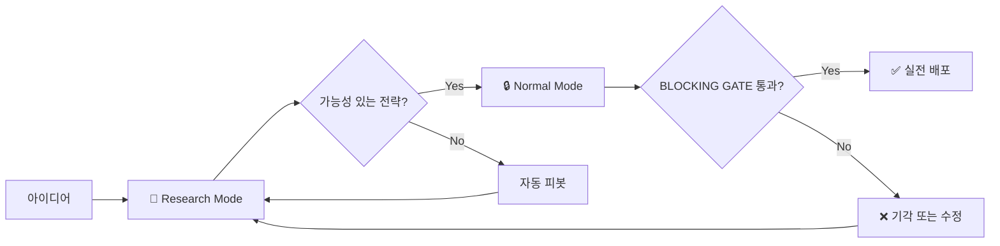

# 🔬 OpenCode Multi-Agent Research Team

> **AI 에이전트 팀 기반의 자율적 퀀트 전략 리서치 프레임워크**

OpenCode의 멀티 에이전트 시스템을 활용하여 구성된 **독립 리서치 팀(Independent Research Team)**입니다. 5인의 전문 AI 에이전트가 협업하여 금융 시장의 알파(Alpha)를 탐색하고, 통계적으로 검증된 트레이딩 전략을 자동으로 발굴합니다.

---

## ✨ 핵심 기능

| 기능 | 설명 |
|------|------|
| **🔄 무한 채굴 모드** | 목표 전략 수 달성까지 멈추지 않고 자동 탐색 |
| **🧪 심층 연구 모드** | 특정 가설에 대해 성공할 때까지 집요하게 파고듦 |
| **📊 실시간 진행 추적** | `research_queue.md`에 상태 자동 업데이트 |
| **🔒 엄격한 통계 검증** | Monte Carlo, Bootstrap, WFO 검증 필수 통과 |
| **⚠️ 3대 배제 원칙** | 오버피팅, 데이터 누수, 편향 엄격히 배제 |

---

## 👥 팀 구성

| 에이전트 | 역할 | 책임 |
|----------|------|------|
| **@research-lead** | Chief Architect | 연구 설계, 가설 수립, 전체 오케스트레이션 |
| **@research-librarian** | PhD Specialist | 논문 검색, 수학적 증명 |
| **@research-data-engineer** | Lead Data Engineer | 데이터 수집/정제, Point-in-Time 보장 |
| **@research-coder** | Lead Financial Engineer | 전략 구현, 백테스팅 엔진 |
| **@research-analyst** | Chief Risk Officer | 통계 검증, 전략 기각 권한 (Finding Gate) |

---

## 🚀 빠른 시작

### 1. 저장소 클론

```bash
git clone https://github.com/your-username/opencode-research-team.git
cd opencode-research-team
```

### 2. 설치 스크립트 실행

**Windows:**
```powershell
.\scripts\install.ps1
```

**Linux/macOS:**
```bash
chmod +x scripts/install.sh
./scripts/install.sh
```

### 3. 리서치 모드 실행

```bash
opencode
> /rt [연구 주제 또는 가설]
```

---

## 📖 사용법

### 리서치 모드 명령어

```bash
# 단건 심층 연구
/rt BTC 펀딩비 기반 역추세 전략

# 무한 채굴 모드 (5개 전략 찾을 때까지)
/rt mine crypto 5

# 중단된 연구 재개
/rt continue queue
```

---

## 🎯 권장 워크플로우: 2단계 검증 프로세스

이 프레임워크는 **Research Mode**와 **Normal Mode**를 조합한 2단계 프로세스를 권장합니다.

### 왜 2단계인가?

| 단계 | 모드 | 목적 | 특징 |
|------|------|------|------|
| **1단계** | 🔬 Research Mode | 창의적 가설 탐색 | 빠른 순환, 대량 아이디어 발굴 |
| **2단계** | 🔒 Normal Mode | 엄격한 최종 검증 | 모든 조건 엄격 적용, 실전 배포 판단 |

### Step 1: Research Mode로 대량 탐색 🔬

```bash
# 리서치 모드 진입 - 창의적 가설 탐색
/rt mine crypto 10
```

**Research Mode의 특징:**
- ✅ **Creativity 우선**: 다양한 가설을 빠르게 순환 테스트
- ✅ **느슨한 초기 필터**: 탐색 속도를 위해 초반 탈락률 낮음
- ✅ **자동 피봇**: 실패 시 자동으로 다른 카테고리로 전환
- ✅ **큐 유지**: 실패한 가설도 큐에 기록 → 변형 가능

> 💡 **핵심**: 이 단계에서는 "될 수도 있는" 가능성 있는 전략들을 최대한 많이 발굴합니다.

### Step 2: Normal Mode로 엄격 검증 🔒

```bash
# 일반 모드에서 최종 검증 요청
@backtester strategy.py 전체 검증해줘
@debugger 3대 배제 원칙 위반 여부 체크해줘
```

**Normal Mode의 특징:**
- ✅ **Rigor 우선**: 6개 BLOCKING GATE 조건 전부 엄격 적용
- ✅ **높은 탈락률**: 하나라도 미통과 시 즉시 기각
- ✅ **집중적 검증**: 단일 전략에 대한 심층 분석
- ✅ **실전 배포 판단**: 통과 = Real Capital 투입 가능

> ⚠️ **핵심**: Research Mode에서 발굴한 전략을 Normal Mode에서 "진짜 되는지" 엄격히 검증합니다.

### 📊 두 모드 비교

| 구분 | 🔬 Research Mode | 🔒 Normal Mode |
|------|------------------|----------------|
| **목적** | 대량 가설 탐색 (Creativity 우선) | 엄격한 최종 검증 (Rigor 우선) |
| **통과 기준** | 동일함 (BLOCKING GATE) | 동일함 (BLOCKING GATE) |
| **실행 강도** | 빠른 순환, 느슨한 초기 필터 | 집중적, 모든 항목 엄격 적용 |
| **탈락률** | 낮음 (큐에 유지) | 높음 (6개 조건 전부 충족 필요) |
| **활성 에이전트** | @research-* 팀 (5인) | @oracle, @coder, @backtester 등 |
| **적합한 상황** | 아이디어 발굴, 초기 리서치 | 실전 배포 전 최종 점검 |

> 📌 **결론**: 검증 "방식"은 동일하지만, Research Mode에서는 탐색 속도를 위해 초기 단계에서 느슨하게 필터링하고, Normal Mode에서 모든 조건을 엄격히 적용하기 때문에 탈락률이 높아집니다.

### 권장 사용 시나리오



---

## 📁 프로젝트 구조

```
opencode-research-team/
├── README.md                    # 이 파일
├── LICENSE                      # MIT 라이선스
├── .gitignore                   # Git 무시 파일
├── config/
│   └── oh-my-opencode.json      # 에이전트 설정
├── docs/
│   ├── AGENTS.md                # 일반 모드 규칙
│   └── RESEARCH_TEAM.md         # 리서치 팀 매뉴얼
├── scripts/
│   ├── install.ps1              # Windows 설치 스크립트
│   └── install.sh               # Linux/macOS 설치 스크립트
└── examples/
    └── pj1/                     # 예시 프로젝트
        ├── FINAL_REPORT.md
        ├── research_queue.md
        └── 01_Sentiment_Funding/
            ├── strategy.py
            └── STRATEGY_REPORT.md
```

---

## 📊 검증 기준 (Blocking Gate)

모든 전략은 아래 조건을 **전부 통과**해야 승인됩니다:

| 항목 | 기준 |
|------|------|
| IS/OOS KPI 비율 | OOS ≥ IS × 70% |
| Monte Carlo p-value | < 0.05 (1000회 셔플) |
| Bootstrap 95% CI | 주요 KPI 하한 > 0 |
| Walk-Forward | 3-fold 이상, Embargo 적용 |
| Trade Count | N > 30 |

---

## 📈 성과 예시

| 전략 | Sharpe (OOS) | MDD | Trade Count |
|------|--------------|-----|-------------|
| Sentiment & Funding | 4.04 | -2.74% | 153 |
| Whale Momentum | 3.77 | -2.40% | 151 |
| News Breakout | 9.35 | -1.53% | 183 |

---

## 📜 라이선스

MIT License - 자세한 내용은 [LICENSE](LICENSE) 파일을 참조하세요.

---

<div align="center">

**Built with [OpenCode](https://github.com/opencode/opencode) 🚀**

*Autonomous Quantitative Research Powered by Multi-Agent AI*

</div>
