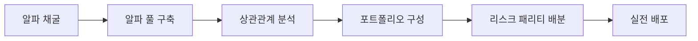

# 🔬 OpenCode Multi-Agent Research Team

> **AI 에이전트 팀 기반의 자율적 퀀트 전략 리서치 프레임워크**

OpenCode의 멀티 에이전트 시스템을 활용하여 구성된 **독립 리서치 팀(Independent Research Team)**입니다. 5인의 전문 AI 에이전트가 협업하여 금융 시장의 알파(Alpha)를 탐색하고, 통계적으로 검증된 트레이딩 전략을 자동으로 발굴합니다.
Claude Code에 접근 불가능하여 Gemini와 호환 모델들을 사용합니다.

+oh-my-opencode에 영감을 받았습니다.
+지속적으로 최적화 업데이트 중입니다

---

## ✨ 핵심 기능

| 기능 | 설명 |
|------|------|
| **🔄 무한 채굴 모드** | 목표 전략 수 달성까지 멈추지 않고 자동 탐색 |
| **🧪 심층 연구 모드** | 특정 가설에 대해 성공할 때까지 집요하게 파고듦 |
| **📊 실시간 진행 추적** | `research_queue.md`에 상태 자동 업데이트 |
| **🔒 엄격한 통계 검증** | Monte Carlo, Bootstrap, WFO 검증 필수 통과 |
| **⚠️ 3대 배제 원칙** | 오버피팅, 데이터 누수, 편향 엄격히 배제 |
| **🎯 로직 다양성 원칙** | 파라미터 변형 금지, 서로 다른 핵심 로직 필수 |
| **🌐 크로스 자산 검증** | 최소 3개 자산에서 유효해야 알파 풀 등록 |
| **📐 백테스팅 표준 환경** | 시장가, 슬리피지 3bps, 거래비용 4bps 통일 |

---

## 👥 팀 구성

| 에이전트 | 역할 | 책임 |
|----------|------|------|
| **@research-lead** | Chief Architect | 연구 설계, 가설 수립, 전체 오케스트레이션 |
| **@research-librarian** | PhD Specialist | 논문 검색, 수학적 증명 |
| **@research-data-engineer** | Lead Data Engineer | 정형/비정형 데이터 수집/정제, Point-in-Time 보장 |
| **@research-coder** | Lead Financial Engineer | 전략 구현, 백테스팅 엔진 |
| **@research-analyst** | Chief Risk Officer | 통계 검증, 전략 기각 권한 (Finding Gate) |

---

## 🚀 빠른 시작

### 1. 저장소 클론
```bash
git clone https://github.com/bucheoncityboy/OpenCode-Multi-Agent-Research-Team.git
cd OpenCode-Multi-Agent-Research-Team
```

### 2. 설치 스크립트 실행
**Windows:**
```powershell
.\scripts\install.ps1
```

**Linux/macOS:**
```bash
chmod +x scripts/install.sh
./scripts/install.sh
```

### 3. 리서치 모드 실행
```bash
opencode
> /rt [연구 주제 또는 가설]
```

---

## 📖 사용법

### 리서치 모드 명령어
```bash
# 단건 심층 연구
/rt BTC 펀딩비 기반 역추세 전략

# 무한 채굴 모드 (10개 전략 찾을 때까지)
/rt mine crypto 10

# 중단된 연구 재개
/rt continue queue
```

### 권장 명령어 형식
```bash
/rt mine crypto 30

조건:
1. RESEARCH_TEAM.md 엄격히 준수
2. OOS Sharpe ≥ 1.0
3. 30개 모두 핵심 로직이 서로 다를 것
4. 백테스팅 표준 환경 적용
5. 목표 달성까지 절대 멈추지 마
```

---

## 🎯 권장 워크플로우: 알파 풀 → 전략 포트폴리오

### 전체 프로세스


### Step 1: 알파 채굴 (Research Mode)
```bash
/rt mine crypto 10
```
- 배치 단위로 대량 채굴
- BLOCKING GATE 자동 통과 검증
- 핵심 로직 다양성 강제

### Step 2: 알파 풀 정리 (Normal Mode)
```bash
FINAL_REPORT.md 보고 성공한 전략들 표로 정리해줘
```

### Step 3: 상관관계 분석
```bash
전략들 상관관계 매트릭스 만들어줘
상관 0.6 이상인 쌍 중 Sharpe 낮은 거 제거해줘
```

### Step 4: 포트폴리오 구성
```bash
남은 전략들로 리스크 패리티 비중 계산해줘
총 자본 $100,000 기준
```

---

## 📐 백테스팅 표준 환경

모든 전략은 **동일한 보수적 표준 환경**에서 최종 검증됩니다:

| 항목 | 표준값 | 적용 시점 |
|------|--------|-----------|
| 체결 시점 | 다음 봉 시가 (Next Bar Open) | 진입/청산 모두 |
| 체결 방식 | 시장가 (Market Order) | 진입/청산 모두 |
| 슬리피지 | 편도 3bps | 진입/청산 각각 |
| 거래 비용 | 편도 4bps | 진입/청산 각각 |
| 데이터 | Binance OHLCV | - |

> **총 비용**: 왕복 14bps

---

## 🚫 로직 다양성 원칙

파라미터만 다른 전략을 여러 개 만드는 것을 **금지**합니다:

| 케이스 | 판정 |
|--------|------|
| EMA 5/60, EMA 10/100, EMA 20/200 각각 등록 | ❌ 금지 |
| 볼린저+RSI, 볼린저+ADX 각각 등록 | ❌ 금지 |
| EMA 크로스 1개 + 볼린저 역추세 1개 | ✅ 허용 |

---

## 🌐 크로스 자산 검증

단일 자산에서만 작동하는 알파는 **과적합**으로 간주됩니다:

| 케이스 | 판정 |
|--------|------|
| BTC에서만 Sharpe 2.0, ETH/SOL 음수 | ❌ 기각 |
| BTC 1.8, ETH 1.5, SOL 1.2 | ✅ 허용 |

**예외**: 김프, 특정 거래소 차익 등 자산 고유 특성 기반 전략

---

## 📊 검증 기준 (Blocking Gate)

모든 전략은 아래 조건을 **전부 통과**해야 승인됩니다:

| 항목 | 기준 |
|------|------|
| IS/OOS KPI 비율 | OOS ≥ IS × 70% |
| Monte Carlo p-value | < 0.05 (1000회 셔플) |
| Bootstrap 95% CI | 주요 KPI 하한 > 0 |
| Walk-Forward | 3-fold 이상, Embargo 적용 |
| Trade Count | N > 30 |
| 크로스 자산 검증 | 3개+ 자산에서 유효 |

---

## 📁 프로젝트 구조

```
opencode-research-team/
├── README.md                    # 이 파일
├── LICENSE                      # MIT 라이선스
├── .gitignore                   # Git 무시 파일
├── config/
│   └── oh-my-opencode.json      # 에이전트 설정
├── docs/
│   ├── AGENTS.md                # 일반 모드 규칙
│   ├── RESEARCH_TEAM.md         # 리서치 팀 매뉴얼
│   └── BLOCKING_GATE.md         # 검증 기준 상세
├── scripts/
│   ├── install.ps1              # Windows 설치 스크립트
│   └── install.sh               # Linux/macOS 설치 스크립트
```

---

## 📊 두 모드 비교

| 구분 | 🔬 Research Mode | 🔒 Normal Mode |
|------|------------------|----------------|
| **목적** | 대량 가설 탐색 | 엄격한 최종 검증 |
| **실행 강도** | 빠른 순환 | 집중적 검증 |
| **활성 에이전트** | @research-* 팀 (5인) | @oracle, @coder 등 |
| **적합한 상황** | 알파 채굴 | 포트폴리오 구성 |

---

## 📜 라이선스
MIT License - 자세한 내용은 [LICENSE](LICENSE) 파일을 참조하세요.

